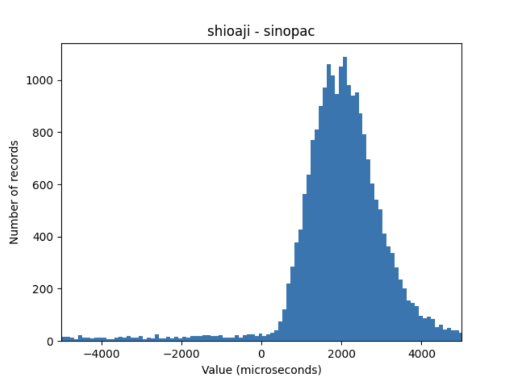

# TWSE-UDP-Resolver

For those operating in IDC/Colo environments, directly consuming UDP packets from the Taiwan Stock Exchange (TWSE) can be significantly faster than using APIs like Shioaji to fetch market data. To facilitate this, a library is required to parse and decode these packets efficiently.

Among all packet formats, only **Format 6** is transmitted in real-time. Other formats are delayed by several seconds, making it more practical to use APIs like Shioaji or other alternatives for non-real-time data. This library focuses solely on parsing **Format 6**.

---

## Build and Install
```
git clone https://github.com/lawrence910426/TWSE-UDP-Resolver.git
git pull --recurse-submodules && git submodule update --init --recursive
pip install .
```

---

## Usage (Python)
```python
import twse_udp_resolver

def handle_packet(packet):
    print("Received packet: ")
    print("Message Length: ", packet.message_length)
    print("Business Type: ", packet.business_type)
    print("Format Code: ", packet.format_code)
    
if __name__ == "__main__":
    port = 12345
    parser = twse_udp_resolver.Parser()
    parser.start_loop(port, handle_packet)
    parser.end_loop()
```

Refer to our [example](./example/twse_udp_resolver_python_interface.py).

---

## Usage (C/C++)

```cpp
#include "parser.h"

void handle_packet(const Packet& packet) {
    // Print basic information from the packet
    std::cout << "Received Packet:" << std::endl;
    std::cout << "Message Length: " << packet.message_length << std::endl;
    std::cout << "Business Type: " << static_cast<int>(packet.business_type) << std::endl;
    std::cout << "Format Code: " << static_cast<int>(packet.format_code) << std::endl;
}

int main() {
    const int port = 12345;
    Parser parser;
    parser.start_loop(port, handle_packet);
    parser.end_loop();
    return 0;
}
```

Refer to our [example](./example/twse_udp_resolver_cpp_interface.cpp).

---

## Benchmark Results

In the IDC data center test environment provided by Sinopac, we observed that directly decoding UDP packets was roughly 2,000 microseconds faster than [shioaji](https://sinotrade.github.io/zh_TW/).

In the chart below, the horizontal axis shows Shioaji’s latency minus the UDP packet latency, and the vertical axis indicates the number of occurrences.



---

## Testing

Navigate to the root directory of this repository and execute the following commands:

```bash
cd test
bash test.sh
```

This script runs the test suite, where `TWSE_mocker.py` sends several example packets to the parser for validation.

### Test Setup

`test.sh` spawns two Docker containers:
1. **Parser Container**: Runs the parser to decode incoming UDP packets.
2. **Mocker Container**: Simulates the TWSE by sending example UDP packets to the parser.

You should see the parser process and handle the packets sent by the mocker during the test.

### Run the cpp example

Run the cpp example with testing mode.

```bash
cd build
./twse_udp_resolver_cpp_interface
```

Run the cpp example with multicast mode.

```bash
./twse_udp_resolver_cpp_interface -multicast 224.0.100.100 -iface 192.168.205.30
```

Run the cpp example with stock filter mode.

```bash
./twse_udp_resolver_cpp_interface -stock 2330
```

Run the cpp example with benchmark mode.

```bash
./twse_udp_resolver_cpp_interface -mode benchmark
```

### Run the python example

Same as the cpp example.

```bash
python3 example/twse_udp_resolver_python_interface.py
```

Run the python example with multicast mode.

```bash
python3 example/twse_udp_resolver_python_interface.py -multicast 224.0.100.100 -iface 192.168.205.30
```

Run the python example with stock filter mode.

```bash
python3 example/twse_udp_resolver_python_interface.py -stock 2330
```

Run the python example with benchmark mode.

```bash
python3 example/twse_udp_resolver_python_interface.py -mode benchmark
```
